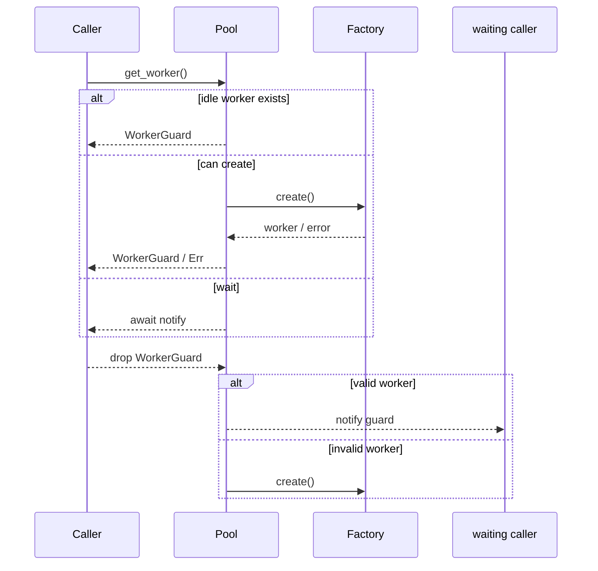
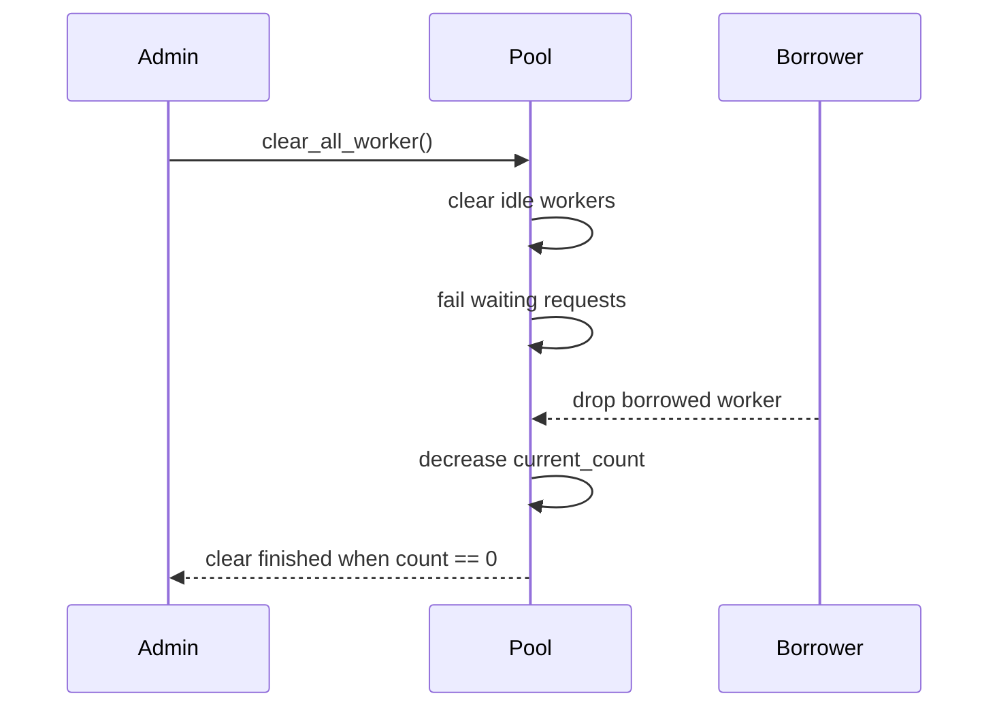

# sfo-pool 设计与实现评审

## 1. 文档目的

本文档基于当前 `sfo-pool` 仓库中的实际实现整理而成，目标是：

- 说明库当前已经实现的对象模型、并发模型和调度语义。
- 为后续维护者提供可对照代码的设计说明。
- 记录本次基于实现的 review 结论，包括已识别的风险点和后续改进方向。

对应代码入口：

- `src/lib.rs`
- `src/worker_pool.rs`
- `src/classified_worker_pool.rs`

## 2. 模块概览

### 2.1 模块结构

库根 [`src/lib.rs`](../src/lib.rs) 只负责重导出两个模块：

- `worker_pool`: 通用异步 worker 池。
- `classified_worker_pool`: 在通用池语义基础上增加分类感知分配。

### 2.2 依赖

当前关键依赖如下：

- `tokio`: 异步运行时与任务派发。
- `async-trait`: 为 trait 提供 async 方法支持。
- `notify-future`: 用于挂起等待者并在资源可用时单次唤醒。
- `sfo-result`: 统一错误类型封装。

## 3. 总体设计

### 3.1 核心抽象

库围绕四组抽象组织：

1. `Worker` / `ClassifiedWorker`
2. `WorkerFactory` / `ClassifiedWorkerFactory`
3. `WorkerPool` / `ClassifiedWorkerPool`
4. `WorkerGuard` / `ClassifiedWorkerGuard`

设计上采用 RAII：

- 调用方通过 `get_worker()` 或 `get_classified_worker()` 获得 guard。
- guard 持有真实 worker。
- guard `Drop` 时自动将 worker 归还给池。

这意味着库把“借出”和“归还”的生命周期绑定在 Rust 所有权模型上，避免显式 `release()` API 造成的遗漏。

### 3.2 状态管理

两个池都使用：

- `Arc` 共享池实例
- `Mutex` 保护内部状态
- 一个空闲 worker 容器
- 一个等待队列
- `current_count` 跟踪当前池中已创建但尚未彻底销毁的 worker 数量
- `clear_notify` 协调 `clear_all_worker()` 对借出中 worker 的等待

因此它们的并发模型是：

- 快路径在锁内完成状态判定
- 慢路径在锁外执行异步创建
- 创建失败后重新回到锁内回滚计数

### 3.3 生命周期语义

worker 在池中的状态可以抽象为：

```text
未创建 -> 已创建/借出 -> 已归还/空闲 -> 再次借出
                         \-> 无效 -> 销毁或替换
```

其中“无效”由业务 worker 自身通过 `is_work()` 决定，而不是由池内部探测。

## 4. 通用 WorkerPool 设计

### 4.1 公开接口

`worker_pool` 暴露以下主要接口：

- `Worker::is_work(&self) -> bool`
- `WorkerFactory::create(&self) -> PoolResult<W>`
- `WorkerPool::new(max_count, factory)`
- `WorkerPool::get_worker()`
- `WorkerPool::clear_all_worker()`

### 4.2 内部状态

`WorkerPoolState` 包含：

- `current_count`: 当前已创建 worker 总数
- `worker_list`: 空闲 worker 队列
- `waiting_list`: 无空闲资源时的等待者队列
- `clear_notify`: 清池过程的完成通知器

空闲容器使用 `VecDeque`，因此：

- 空闲 worker 复用策略是 FIFO
- 等待者唤醒策略也是 FIFO

### 4.3 获取 worker 流程

`get_worker()` 的判定顺序：

1. 若池正在清理，立即返回错误。
2. 尝试从空闲队列取 worker。
3. 若取到的 worker 已失效，则减少 `current_count` 并继续扫描。
4. 若存在有效空闲 worker，直接返回 guard。
5. 若没有空闲 worker 且 `current_count < max_count`，先占用一个创建名额，再在锁外异步创建。
6. 若已达到上限，则进入等待队列并挂起。

### 4.4 归还 worker 流程

`WorkerGuard` 在 `Drop` 中调用池的 `release()`：

- 若池正在 `clear_all_worker()`，归还的 worker 不再复用，仅递减 `current_count`。
- 若 worker 仍有效：
  - 优先唤醒一个等待者；
  - 否则回收到空闲队列。
- 若 worker 已失效：
  - 若存在等待者，异步创建一个新 worker 直接交付等待者；
  - 若没有等待者，仅递减 `current_count`。

### 4.5 清池语义

`clear_all_worker()` 的行为不是“立即粗暴销毁全部 worker”，而是：

- 立即清空空闲 worker；
- 立即拒绝当前等待中的请求；
- 阻止新的获取请求；
- 对已经借出的 worker，等待其后续归还时自然退出池；
- 当 `current_count` 归零后结束清理。

这是一个“逻辑清空 + 等待在途资源回收”的实现。

## 5. 分类池 ClassifiedWorkerPool 设计

### 5.1 设计目标

分类池希望解决的问题是：

- 部分 worker 只能服务特定分类请求；
- 空闲 worker 需要按分类复用；
- 在无匹配空闲 worker 时，允许按分类创建新 worker。

### 5.2 新增抽象

相较于通用池，分类池增加：

- `WorkerClassification`: 分类标识 trait
- `ClassifiedWorker::is_valid(c)`: 判断 worker 是否可处理目标分类
- `ClassifiedWorker::classification()`: 返回 worker 的自身分类
- `ClassifiedWorkerFactory::create(Option<C>)`: 支持按分类创建 worker

### 5.3 内部状态

`ClassifiedWorkerPool` 的状态比通用池多两个结构：

- `classified_count_map`: 按分类统计已创建 worker 数量
- `waiting_list`: 每个等待项都带一个 `condition: Option<C>`

其中：

- `None` 表示普通 `get_worker()` 请求
- `Some(c)` 表示 `get_classified_worker(c)` 请求

### 5.4 普通获取流程

`get_worker()` 的行为基本和通用池一致：

- 可复用任意有效空闲 worker
- 创建时调用 `factory.create(None)`
- 创建成功后根据 `worker.classification()` 更新分类计数

### 5.5 分类获取流程

`get_classified_worker(classification)` 的行为如下：

1. 若正在清理，直接失败。
2. 遍历空闲列表，先剔除无效 worker，并同步修正分类计数。
3. 从剩余空闲 worker 中查找第一个 `worker.is_valid(classification)` 的实例。
4. 若找到，直接借出。
5. 若未找到，则根据当前计数决定：
   - 创建一个新 worker；
   - 或进入带条件的等待队列。

### 5.6 归还流程

归还时分两类：

- 有效 worker：
  - 优先匹配等待队列中的普通请求；
  - 再匹配第一个与其兼容的分类请求；
  - 都没有则放回空闲列表。
- 无效 worker：
  - 尝试为等待者异步补建 worker；
  - 若无等待者，则减少总数和分类计数。

### 5.7 分类池当前实现的隐含假设

虽然接口提供了 `is_valid(c)`，看起来支持“一个 worker 服务多个分类”的能力，但当前实现实际还依赖以下假设：

- 每个 worker 有一个稳定的主分类 `classification()`
- 分类计数是按这个主分类维护的
- 无效 worker 触发补建时，往往按其主分类补建
- 某些等待匹配逻辑直接按分类相等判断，而不是统一使用 `is_valid`

因此当前实现更接近“单主分类 worker + 可选兼容判断”的模型，而不是完全泛化的多分类能力模型。

## 6. 并发与时序

### 6.1 通用池时序



### 6.2 清池时序



## 7. 错误模型

当前错误类型统一为：

- `PoolErrorCode`
- `PoolError`
- `PoolResult<T>`

目前 `PoolErrorCode` 包含：

- `Failed`
- `Clearing`
- `Cleared`
- `InvalidConfig`

其中当前已稳定使用的错误语义包括：

- `Clearing`: 获取请求发生在 clearing 过程中
- `Cleared`: 请求在创建或等待期间被清池中断
- `InvalidConfig`: 例如 `max_count == 0`

因此调用方已经可以基于错误码做稳定的程序化分支判断，不必依赖错误字符串。

## 8. 测试现状

当前测试分为两类：

- 原有集成式行为测试：
  - 容量耗尽后的等待
  - 清池时等待请求失败
  - 清池对借出中 worker 的等待
  - 分类请求与普通请求共存
- 补充的回归测试：
  - `max_count == 0` 时立即返回错误
  - 并发多次 `clear_all_worker()` 不会互相挂死
  - 创建过程与 clearing 并发时，请求会失败且清理能完成
  - 分类池不会突破 `max_count`

`cargo test` 当前结果：

- 11 个测试全部通过
- 总耗时约 25 秒

## 9. 实现评审结论

本轮修复后，以下高风险问题已经消除：

- `release()` 与 `clear_all_worker()` 的竞态
- 并发多次 `clear_all_worker()` 的互相覆盖
- 创建过程与 clearing 并发时仍返回成功
- 分类池突破 `max_count`
- 测试专用 import 导致的编译告警

当前仍需关注的主要问题如下。

### 9.1 中：分类兼容模型仍然偏向“单主分类”

虽然接口提供了 `is_valid(c)`，但状态统计仍以 `classification()` 为主分类单位维护，并且当前实现已经要求 `create(Some(c))` 必须返回 `classification() == c` 的 worker。因此当前实现更适合：

- 一个 worker 绑定一个主分类
- `is_valid()` 作为兼容性扩展，而不是完全泛化的多分类供给模型

如果业务需要“一个 worker 同时稳定覆盖多个分类”的严格语义，仍建议进一步收窄接口或重构计数模型。

### 9.2 中：测试仍依赖真实时间睡眠

当前慢测试仍保留了原始的秒级睡眠与耗时断言，因此：

- 全量测试耗时仍约 25 秒
- 在高抖动 CI 环境里仍可能比事件驱动测试更脆弱

如果后续继续演进，建议逐步替换为 `tokio::time::pause()`、`advance()` 或显式通知驱动的测试写法。

## 10. 建议的后续演进

### 10.1 API 层

- 为错误类型增加可区分的错误码，例如 `Clearing`、`Cleared`、`CreateFailed`。
- 保持 `max_count` 为硬上限的语义，并在 README 或 API 文档中显式说明。
- 明确分类模型：单分类还是多分类兼容。

### 10.2 实现层

- 若保持分类池，建议把“匹配等待者”和“补建 worker”的决策逻辑抽成独立私有函数。
- 为 `clear_all_worker()` 增加状态机注释，降低后续修改时的竞态风险。
- 重新审视 `classified_count_map` 是否真的能表达供给能力。

### 10.3 测试层

- 继续补充：
  - 无效 worker 替换时的分类正确性
  - 多等待者下的公平性
  - 清池与创建失败并发发生时的回滚一致性
  - 多分类兼容 worker 的行为边界

## 11. 总结

当前 `sfo-pool` 的通用池实现简洁，RAII 归还模型清晰，`clear_all_worker()` 的并发语义已经收敛。分类池现在也遵守全局 `max_count`，并补上了 clearing 相关竞态保护。

后续继续演进时，优先事项仍然是进一步收敛分类池语义，并把慢测试逐步替换成更稳定的事件驱动测试。
