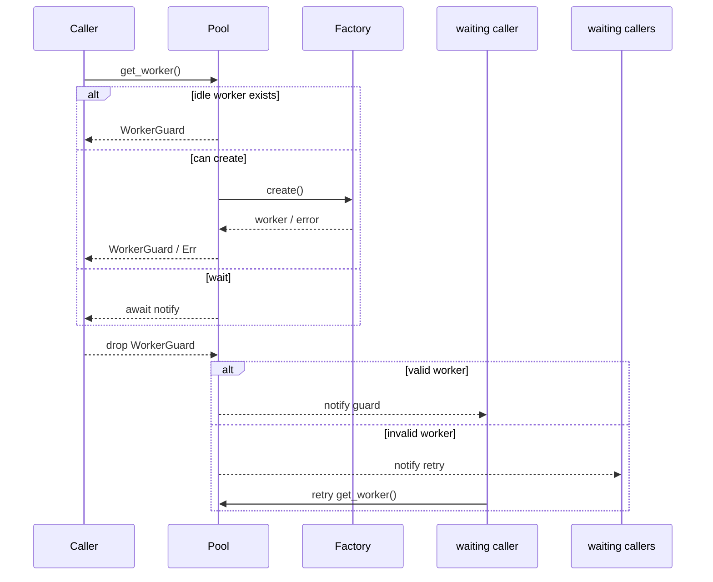
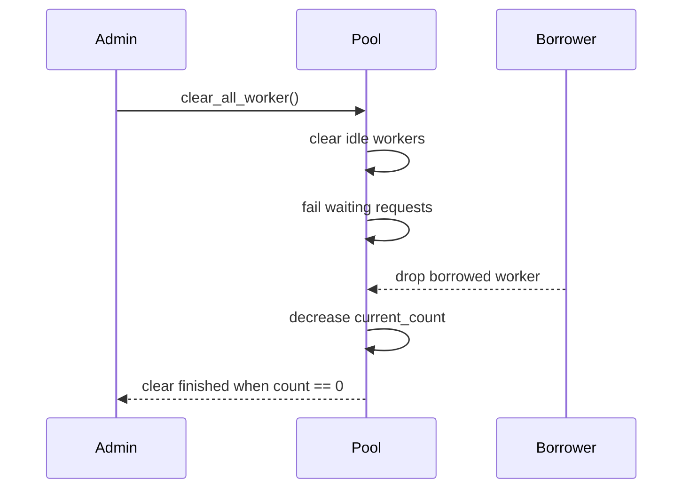

# sfo-pool 设计与实现评审

## 1. 文档目的

本文档基于当前 `sfo-pool` 仓库中的实际实现整理而成，目标是：

- 说明库当前已经实现的对象模型、并发模型和调度语义。
- 为后续维护者提供可对照代码的设计说明。
- 记录本次基于实现的 review 结论，包括已识别的风险点和后续改进方向。

对应代码入口：

- `src/lib.rs`
- `src/worker_pool.rs`
- `src/keyed_worker_pool.rs`

## 2. 模块概览

### 2.1 模块结构

库根 [`src/lib.rs`](../src/lib.rs) 只负责重导出两个模块：

- `worker_pool`: 通用异步 worker 池。
- `keyed_worker_pool`: 在通用池语义基础上增加键控分配。

### 2.2 依赖

当前关键依赖如下：

- `tokio`: 异步运行时与任务派发。
- `async-trait`: 为 trait 提供 async 方法支持。
- `notify-future`: 用于挂起等待者并在资源可用时单次唤醒。
- `sfo-result`: 统一错误类型封装。

## 3. 总体设计

### 3.1 核心抽象

库围绕四组抽象组织：

1. `Worker` / `KeyedWorker`
2. `WorkerFactory` / `KeyedWorkerFactory`
3. `WorkerPool` / `KeyedWorkerPool`
4. `WorkerGuard` / `KeyedWorkerGuard`

设计上采用 RAII：

- 通用池通过 `get_worker()` 获取 guard，键池通过 `get_worker(key)` 获取明确键的 guard。
- guard 持有真实 worker。
- guard `Drop` 时自动将 worker 归还给池。
- 键 guard 保留可变解引用；池会缓存 factory 创建并校验时的主键。worker 归还时如果当前键与缓存的主键不一致，池会直接删除该 worker，避免键计数与实际状态不一致。

这意味着库把“借出”和“归还”的生命周期绑定在 Rust 所有权模型上，避免显式 `release()` API 造成的遗漏。

### 3.2 状态管理

两个池都使用：

- `Arc` 共享池实例
- `Mutex` 保护内部状态
- 一个空闲 worker 容器
- 一个等待队列
- `current_count` 跟踪当前池中已创建但尚未彻底销毁的 worker 数量
- `clear_waiting_list` 协调 `clear_all_worker()` 对借出中 worker 或创建中 worker 的等待
- `WorkerPoolConfig` 控制通用池可选的总量上限和 idle worker 释放策略
- `KeyedWorkerPoolConfig` 控制键池可选的总量目标、idle worker 释放策略和单键 worker 数量上限

因此它们的并发模型是：

- 快路径在锁内完成状态判定
- 慢路径在锁外执行异步创建
- 创建名额由 RAII reservation guard 管理；创建失败或创建 future 被取消时自动回滚计数，并唤醒当前等待者重试
- idle worker 释放是懒惰触发的：在获取 worker 前清理，也可以由调用方显式调用 `cleanup_idle_worker()`

### 3.3 生命周期语义

worker 在池中的状态可以抽象为：

```text
未创建 -> 已创建/借出 -> 已归还/空闲 -> 再次借出
                         \-> 无效 -> 销毁或替换
```

其中“无效”由业务 worker 自身通过 `is_work()` 决定。键池还会在获取空闲 worker 和归还 worker 时校验缓存的主键；当前键发生变化，或者 `supports(primary_key)` 返回 `false` 的 worker 会直接销毁，不进入空闲队列。

## 4. 通用 WorkerPool 设计

### 4.1 公开接口

`worker_pool` 暴露以下主要接口：

- `Worker::is_work(&self) -> bool`
- `WorkerFactory::create(&self) -> PoolResult<W>`
- `WorkerPool::new(max_count, factory)`
- `WorkerPool::new_with_config(factory, config)`
- `WorkerPool::get_worker()`
- `WorkerPool::cleanup_idle_worker()`
- `WorkerPool::clear_all_worker()`

`Worker` trait 方法可能在池的内部状态锁持有期间被调用，因此实现必须快速、非阻塞，并且不能重入同一个池的 API。

### 4.2 内部状态

`WorkerPoolState` 包含：

- `current_count`: 当前已创建 worker 总数
- `worker_list`: 空闲 worker 队列
- `waiting_list`: 无空闲资源时的等待者队列
- `clear_waiting_list`: 清池过程的完成通知器集合

空闲容器使用 `VecDeque`，因此：

- 空闲容器头部保存最久未使用的 idle worker
- 空闲容器尾部保存最近归还的 idle worker
- 空闲 worker 复用策略是 MRU：优先从队列尾部取最近使用过的 worker
- idle 释放策略是 LRU：优先从队列头部释放最久未使用且已超时的 worker
- 通用池等待者唤醒策略是 FIFO

这样可以让最近活跃的 worker 保持热状态，同时让长期未使用的 worker 更容易被释放。

### 4.3 获取 worker 流程

`get_worker()` 的判定顺序：

1. 若池正在清理，立即返回错误。
2. 先懒惰清理已超时的 idle worker。
3. 尝试从空闲队列尾部取最近使用过的 worker。
4. 若取到的 worker 已失效，则减少 `current_count` 并继续扫描。
5. 若存在有效空闲 worker，直接返回 guard。
6. 若没有空闲 worker，且 `max_count` 为 `None` 或 `current_count < max_count`，先占用一个创建名额，再在锁外异步创建。
7. 若配置了有限上限且已达到上限，则进入等待队列并挂起。

### 4.4 归还 worker 流程

`WorkerGuard` 在 `Drop` 中调用池的 `release()`：

- 若池正在 `clear_all_worker()`，归还的 worker 不再复用，仅递减 `current_count`。
- 若 worker 仍有效：
  - 优先唤醒一个等待者；
  - 否则带 `idle_since` 时间戳回收到空闲队列尾部。
- 若 worker 已失效：
  - 递减 `current_count`；
  - 若存在等待者，唤醒当前等待队列中的所有等待者重试，由等待者在自己的 `get_worker()` 调用中重新竞争容量并创建 worker；
  - 若没有等待者，则不再做额外处理。

### 4.5 清池语义

`clear_all_worker()` 的行为不是“立即粗暴销毁全部 worker”，而是：

- 立即清空空闲 worker；
- 立即拒绝当前等待中的请求；
- 阻止新的获取请求；
- 对已经借出的 worker，等待其后续归还时自然退出池；
- 当 `current_count` 归零后结束清理。

这是一个“逻辑清空 + 等待在途资源回收”的实现。

## 5. 键池 KeyedWorkerPool 设计

### 5.1 设计目标

键池希望解决的问题是：

- 部分 worker 只能服务特定键请求；
- 空闲 worker 需要按键复用；
- 在无匹配空闲 worker 时，允许按键创建新 worker。

### 5.2 新增抽象

相较于通用池，键池增加：

- `WorkerKey`: 键标识 trait
- `KeyedWorker::supports(key)`: 判断 worker 是否可处理目标键
- `KeyedWorker::primary_key()`: 返回 worker 的自身键
- `KeyedWorkerFactory::create(K)`: 按明确键创建 worker
- `KeyedWorkerPool::new(factory, config)`: 创建键池；配置可省略总量目标
- `KeyedWorkerPool::cleanup_idle_worker()`: 显式触发 idle worker 懒惰清理

`KeyedWorker` trait 方法可能在池的内部状态锁持有期间被调用，因此实现必须快速、非阻塞，并且不能重入同一个池的 API。

### 5.3 内部状态

`KeyedWorkerPool` 的状态比通用池多几类键相关结构：

- `worker_count_by_key`: 按键统计已创建 worker 数量
- `pending_count_by_key`: 按键统计已经预留名额、但 `factory.create(key)` 尚未完成的创建任务数量
- `waiting_list`: 每个等待项都带一个明确的 `key: K`
- `worker_list`: 带 `idle_since` 的 idle worker 队列，头部最旧、尾部最新

已取消的等待项会在后续获取或 worker 归还时从等待队列中删除。键池不提供无键的 `get_worker()`，因此创建、等待和重试始终携带明确键。

### 5.4 键获取流程

`get_worker(key)` 的行为如下：

1. 若正在清理，直接失败。
2. 先懒惰清理已超时的 idle worker，并同步修正键计数。
3. 遍历空闲列表，剔除无效 worker，并同步修正键计数。
4. 从剩余空闲 worker 中自尾向头查找第一个 `worker.supports(key)` 的实例。
5. 若找到，直接借出。
6. 若目标键已达到 `max_count_per_key`，进入带条件的等待队列。
7. 若未达到单键上限，且 `max_count` 为 `None` 或 `current_count < max_count`，占用一个创建名额并创建目标键 worker。
8. 若配置了有限 `max_count`、已达到目标且存在不匹配的 idle worker，优先淘汰最久未使用的不匹配 idle worker，并复用该名额创建目标键 worker。
9. 若已达到有限 `max_count` 且没有 idle worker 可淘汰：
   - 如果目标键当前没有已创建或正在创建的 worker，则临时突破 `max_count` 创建该键 worker；
   - 否则进入带条件的等待队列。

### 5.5 归还流程

归还时分三类：

- 当前键与创建时缓存的主键不一致，或 worker 已不能服务缓存的主键：
  - 直接减少总数和缓存主键的计数并删除 worker；
  - 若存在等待者，则唤醒等待者重试。

- 有效 worker：
  - 优先交付等待队列中第一个可匹配的请求；
  - 每个等待请求都通过 `worker.supports(key)` 判断是否匹配；
  - 如果当前 worker 不能匹配任何等待者，但存在尚未达到单键上限的键等待者，则淘汰当前 worker，并唤醒当前等待队列中的所有等待者重试；
  - 如果当前 worker 是临时突破 `max_count` 后产生的多余容量，且没有等待者需要它，则直接释放，避免长期超过目标容量；
  - 其他情况下带 `idle_since` 时间戳放回空闲队列尾部。
- 无效 worker：
  - 若存在等待者，则唤醒当前等待队列中的所有等待者重试，由等待者按自己的请求条件重新获取或创建 worker；
  - 若无等待者，则减少总数和键计数。

### 5.6 键池当前实现的隐含假设

虽然接口提供了 `supports(key)`，看起来支持“一个 worker 服务多个键”的能力，但当前实现实际还依赖以下假设：

- 每个 worker 在创建并校验时确定一个池内主键；worker 在后续获取和归还校验中必须仍然报告该键并对该键有效，否则会被直接删除
- 键计数是按这个主键维护的
- 键请求创建中会先记录到 `pending_count_by_key`，用于判断某个键是否已经有已创建或正在创建的 worker
- 由重试触发的新建 worker 会按等待者自己的请求条件调用 `create(key)`
- `create(key)` 必须返回 `primary_key() == key` 且对自身主键有效的 worker
- `KeyedWorkerGuard` 提供 `DerefMut`；键计数使用创建时缓存的主键，归还时会校验当前键是否仍与其一致

因此当前实现更接近“单主键 worker + 可选兼容判断”的模型，而不是完全泛化的多键能力模型。

## 6. 并发与时序

### 6.1 通用池时序



### 6.2 清池时序



## 7. 错误模型

当前错误类型统一为：

- `PoolErrorCode`
- `PoolError`
- `PoolResult<T>`

目前 `PoolErrorCode` 包含：

- `Failed`
- `Clearing`
- `Cleared`
- `InvalidConfig`

其中当前已稳定使用的错误语义包括：

- `Clearing`: 获取请求发生在 clearing 过程中
- `Cleared`: 请求在创建或等待期间被清池中断
- `InvalidConfig`: 例如 `max_count == 0`、创建出的键 worker 与请求键不匹配、worker 对自身主键无效等配置或实现校验失败

因此调用方已经可以基于错误码做稳定的程序化分支判断，不必依赖错误字符串。

## 8. 测试现状

当前测试分为两类：

- 原有集成式行为测试：
  - 容量耗尽后的等待
  - 清池时等待请求失败
  - 清池对借出中 worker 的等待
  - 多键请求共存
- 补充的回归测试：
  - `max_count == 0` 时立即返回错误
  - 并发多次 `clear_all_worker()` 不会互相挂死
  - 创建过程与 clearing 并发时，请求会失败且清理能完成
  - 键池在满池且无目标键 worker 时允许为该键临时突破 `max_count`
  - 键池在存在不匹配 idle worker 时会淘汰 idle 并创建目标键 worker
  - 键等待者可在不匹配 worker 归还时触发替换创建
  - 键创建失败后会唤醒后续同键等待者重新获取
  - `create(key)` 返回不匹配键时会失败并回滚计数
  - factory 返回的 worker 必须对自身主键有效
  - 被取消的等待者不会阻塞后续 retry 通知
  - 创建 future 被取消时会自动释放预留名额，后续获取与清池不会永久等待
  - idle worker 在状态锁释放后才执行析构，析构重入清理接口不会死锁
  - 键池创建、idle 替换创建和临时超限创建的取消路径均会回滚 reservation
  - 通用池和键池的超时清理、无效 idle 扫描、键替换与清池路径均在状态锁外析构 worker
  - worker 归还时键发生变化或对缓存的主键失效会直接删除，并唤醒键等待者重新获取
  - idle worker 对缓存的主键失效后，会在后续获取扫描中被删除并释放对应键配额
  - 缓存主键在 idle 清理、无效扫描、替换、clearing 和超限回落路径中保持计数一致
  - 单键上限会阻塞对应键，但不会阻塞其他键创建
  - 同键等待者保持队列优先级
  - idle worker 超时后会释放并允许后续重新创建
  - 未超时 idle worker 会被复用
  - 多个 idle worker 中优先复用最近使用过的 worker
  - 显式调用 `cleanup_idle_worker()` 可以触发 idle 清理

历史测试中的后台任务现在会被 `JoinHandle` 等待，避免子任务内断言失败但主测试仍通过。

`cargo test` 当前结果：

- 54 个测试全部通过
- 单元测试执行耗时约 0.13 秒，不含增量编译时间

## 9. 实现评审结论

本轮修复后，以下高风险问题已经消除：

- `release()` 与 `clear_all_worker()` 的竞态
- 并发多次 `clear_all_worker()` 的互相覆盖
- 创建过程与 clearing 并发时仍返回成功
- 键池临时突破 `max_count` 的语义已经收敛为“每个缺失键最多一个已创建或正在创建的 worker”
- 测试专用 import 导致的编译告警

当前仍需关注的主要问题如下。

### 9.1 中：键兼容模型仍然偏向“单主键”

虽然接口提供了 `supports(key)`，但状态统计仍以 `primary_key()` 为主键单位维护，并且当前实现要求 `create(key)` 必须返回 `primary_key() == key` 的 worker。因此当前实现更适合：

- 一个 worker 绑定一个主键
- `supports()` 作为兼容性扩展，而不是完全泛化的多键供给模型

如果业务需要“一个 worker 同时稳定覆盖多个键”的严格语义，仍建议进一步收窄接口或重构计数模型。

### 9.2 低：测试仍依赖少量真实时间睡眠

当前秒级慢测试已改为会等待子任务的毫秒级测试，但仍保留少量真实时间 `sleep`，因此：

- 在高抖动 CI 环境里仍可能比事件驱动测试更脆弱

如果后续继续演进，建议逐步替换为 `tokio::time::pause()`、`advance()` 或显式通知驱动的测试写法。

### 9.3 低：键池 `max_count` 现在是目标上限

配置有限 `max_count` 时，键池仍尽量保持该目标：键请求满池时，会先淘汰不匹配 idle worker 来复用名额；等待中的键请求遇到不匹配 worker 归还时，也会替换创建目标键 worker。`max_count` 为 `None` 时不限制池总量。

如果所有 worker 都处于借出或创建中，没有 idle worker 可淘汰，并且目标键当前没有已创建或正在创建的 worker，键请求会临时突破 `max_count` 创建该键 worker。后续多余 worker 归还且没有等待者需要它时，会被释放以回落到目标容量。

## 10. 建议的后续演进

### 10.1 API 层

- 当前已经有 `Clearing`、`Cleared`、`InvalidConfig` 等可区分错误码；如果调用方需要区分 factory 创建失败和配置/校验失败，可再增加类似 `CreateFailed` 或 `ValidationFailed` 的错误码。
- 在 README 或 API 文档中显式说明 `max_count`：通用池为硬上限；键池会为缺失键临时突破该目标上限。
- 明确键模型：单键还是多键兼容。
- 通用池提供带显式上限的 `new(max_count, factory)` 和 `new_with_config(factory, config)`；键池提供 `new(factory, config)`。配置中的 `max_count` 默认为 `None`，表示不限制总量。如果需要真正后台自动释放，需要再增加内部定时任务或明确要求调用方周期性调用 `cleanup_idle_worker()`。

### 10.2 实现层

- 若保持键池，建议把“匹配等待者”和“创建 worker”的决策逻辑抽成独立私有函数。
- 为 `clear_all_worker()` 增加状态机注释，降低后续修改时的竞态风险。
- 重新审视 `worker_count_by_key` 是否真的能表达供给能力。

### 10.3 idle worker 释放实现

当前已经支持 idle worker 懒惰释放。该能力的目标是：

- worker 被归还到池后进入 idle 状态；
- 如果 idle worker 超过配置的空闲时长仍未被再次借出，则在下一次获取或显式清理时从池中移除并 drop；
- 借出中的 worker 不受 idle 超时影响；
- 正在 `factory.create()` 的 worker 不受 idle 超时影响；
- `clear_all_worker()` 仍然拥有最高优先级，清池过程应直接清空 idle worker，并等待借出中或创建中的 worker 完成当前语义。

配置结构的字段保持私有，调用方通过 `Default` 和链式接口创建配置，避免依赖字段布局：

```rust
let worker_config = WorkerPoolConfig::default()
    .with_max_count(Some(16))
    .with_max_idle_count(Some(8))
    .with_idle_timeout(Some(Duration::from_secs(60)));

let keyed_config = KeyedWorkerPoolConfig::default()
    .with_max_count(Some(16))
    .with_max_idle_count(Some(8))
    .with_idle_timeout(Some(Duration::from_secs(60)))
    .with_max_count_per_key(Some(4))
    .with_max_idle_count_per_key(Some(2));

let classified_config = ClassifiedWorkerPoolConfig::default()
    .with_max_count(Some(16))
    .with_max_idle_count(Some(8))
    .with_idle_timeout(Some(Duration::from_secs(60)))
    .with_max_count_per_classification(Some(4))
    .with_max_idle_count_per_classification(Some(2));
```

其中：

- 所有配置项缺省为 `None`；
- `max_count` 表示池总量上限；普通池严格遵守该上限，键池和分类池在为缺失的 key/classification 创建 worker 时允许临时突破该目标值；`Some(0)` 是无效配置；
- `KeyedWorkerPoolConfig::max_count_per_key` 缺省为 `None`，表示不限制单个主键的 worker 数量；
- `ClassifiedWorkerPoolConfig::max_count_per_classification` 缺省为 `None`，表示不限制单个主分类的 worker 数量；
- 分组总量上限统计已创建和正在创建的 worker，`Some(0)` 是无效配置；
- `max_idle_count` 只限制全池 idle worker 数量，不统计借出中或正在创建的 worker；
- `max_idle_count_per_key` 和 `max_idle_count_per_classification` 分别限制单个主键、主分类的 idle worker 数量；
- idle 上限为 `Some(0)` 时禁用对应范围的 idle 缓存，但不阻止创建或借出 worker；
- `idle_timeout` 为 `None` 表示禁用 idle worker 超时释放，保持当前行为；
- `idle_timeout` 为 `Some(duration)` 表示 idle worker 超过该时间后可被释放。

worker 归还时优先直接交付给兼容等待者。没有兼容等待者时，worker 进入空闲队列尾部成为 MRU；键池和分类池先淘汰同 key/classification 下最旧的超限 idle worker，再按全池上限从队列头部淘汰 LRU。淘汰必须同步递减 `current_count` 和对应分组计数，worker 的析构必须发生在状态锁之外。

普通池已经把空闲队列元素从 `W` 调整为带时间戳的结构：

```rust
struct IdleWorker<W> {
    worker: W,
    idle_since: Instant,
}
```

键池和分类池同样保存 idle 时间戳，并且释放 idle worker 时同步更新对应分组计数：

- `current_count -= 1`
- 键池的 `worker_count_by_key` 或分类池的 `classified_count_map` 中对应计数减一

必须保持的计数不变量是：

```text
current_count = 借出 worker 数 + idle worker 数 + 正在 create 的 worker 数
```

idle worker 懒惰释放不能破坏这个不变量，也不能让 `clear_all_worker()` 等待逻辑提前结束或永久等待。

### 10.4 最近使用优先分配实现

对外分配 worker 时，当前实现优先分配最近使用过的 idle worker。该策略适用于普通池和键池。

统一约定：

```text
空闲容器头部 = 最久未使用的 idle worker
空闲容器尾部 = 最近归还的 idle worker
```

普通池：

- `release()` 在没有等待者时将有效 worker 追加到队列尾部；
- `get_worker()` 从队列尾部取 worker；
- idle 释放从队列头部开始释放过期 worker。

键池：

- `get_worker(key)` 应从尾部向头部查找第一个满足 `worker.supports(key)` 的 worker；
- 键请求满池且没有匹配 idle worker 时，先淘汰最久未使用的不匹配 idle worker，再创建目标键 worker；
- 若没有 idle worker 可淘汰，且目标键当前没有已创建或正在创建的 worker，则临时突破 `max_count` 创建目标键 worker；
- idle 释放从头部开始释放最久未使用的 worker；
- 释放键 idle worker 时同步维护 `worker_count_by_key`。

等待者优先级不应被 MRU 策略改变：归还 worker 时如果已有可匹配等待者，应直接交付等待者，而不是先放入 idle 队列。

### 10.5 测试层

- 继续补充：
  - 无效 worker 替换时的键正确性
  - 多等待者下的公平性
  - 清池与创建失败并发发生时的回滚一致性
  - 多键兼容 worker 的行为边界
  - 键池释放 idle worker 后键计数保持一致
  - idle 释放与 `clear_all_worker()` 并发时不重复扣减计数、不挂死

## 11. 总结

当前 `sfo-pool` 的通用池实现简洁，RAII 归还模型清晰，`clear_all_worker()` 的并发语义已经收敛。键池默认通过“淘汰不匹配 idle worker + 归还时唤醒等待者重试”的策略尽量保持 `max_count`，并会为缺失键临时突破目标容量。idle worker 目前采用“获取前清理 + 显式清理”的懒惰释放模型，并使用 MRU 策略优先复用最近归还的 worker。

后续继续演进时，优先事项仍然是进一步收敛键池语义，并把键等待和创建决策抽成更清晰的内部状态机。
